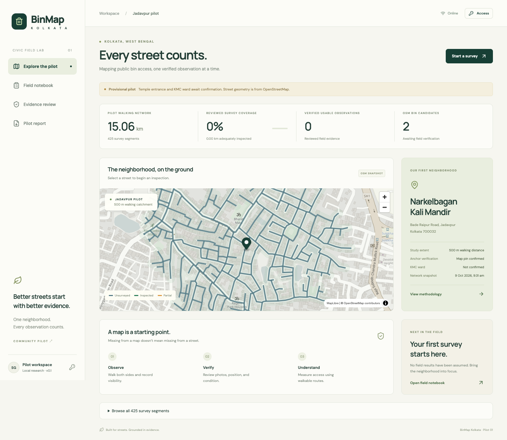

# BinMap Kolkata

**Every street counts.** A local-first civic survey application for documenting access to public pedestrian litter bins around Narkelbagan Kali Mandir, Jadavpur.



BinMap distinguishes **unmapped**, **unverified**, **partially inspected**, and **reviewed evidence**. An empty map never proves a bin is absent.

## What works in v0.1

- Real OSM pedestrian network extraction with a 500 m along-network catchment, partial edges, and anchor-to-edge offset.
- Saved OSM XML fallback when Overpass is unavailable; reproducible source hashes and metadata.
- React/TypeScript + MapLibre map, street selection, mobile survey forms, GPS and photo capture.
- IndexedDB drafts and photo blobs; offline reload after first online visit; explicit sync with immutable IDs.
- FastAPI backend with SQLite for a frictionless local start, and PostgreSQL/PostGIS through Docker Compose.
- Separate survey and reviewer keys. Evidence is private until reviewed; photos remain reviewer-only.
- Photo metadata removal, SHA-256 evidence hashes, append-only observations/reviews/audit events.
- Public GeoJSON export and a printable report, excluding private notes, identities and photographs.
- Experimental shortest walking-distance analysis to approved, recent, usable observations.
- API/graph tests, browser workflow tests, and a PostGIS CI integration check.

## Start on a Mac or Linux machine

Requires Python 3.14 and Node.js 24. Docker is optional. Commands run from this repository root.

```sh
python3 -m venv .venv
.venv/bin/pip install -r requirements.txt
.venv/bin/python scripts/setup_local.py
npm --prefix frontend ci
npm --prefix frontend run build
./scripts/run_local.sh
```

Open **http://127.0.0.1:8000**. API docs: **http://127.0.0.1:8000/docs**.

`setup_local.py` creates `.env` once, with separate randomly generated survey and review keys. Open the file locally and paste the appropriate key into the app's **Access** panel. Keys are kept in browser memory only. Do not commit them. GitHub credentials are never used by this application.

The app starts honestly empty unless you import a real pilot. No demonstration observations are inserted in the real database.

## Reproduce the actual pilot

The user-selected Google Maps pin is **22.4909012, 88.3677315**, from [the supplied landmark link](https://maps.app.goo.gl/fjJ3G3CQi7iCdz4h7). The place coordinate is taken from the link's `!3d`/`!4d` fields, not the viewport's `@` coordinates.

A selected map pin confirms the intended landmark, not field-verified entrance access. The KMC ward remains unverified.

### Preferred Overpass download

```sh
.venv/bin/python scripts/build_pilot.py \
  --lat 22.4909012 --lon 88.3677315 \
  --source https://maps.app.goo.gl/fjJ3G3CQi7iCdz4h7 \
  --user-confirmed-pin
```

If the default public server fails, `--overpass-url https://overpass.private.coffee/api` selects another instance. Respect upstream usage limits; do not repeatedly poll failed public services.

### Saved XML fallback used for the first pilot

Both Overpass endpoints failed during initial setup. A single small OSM map API request succeeded:

```sh
.venv/bin/python scripts/download_osm.py --bbox 88.3585,22.483,88.3762,22.500
.venv/bin/python scripts/build_pilot.py \
  --lat 22.4909012 --lon 88.3677315 \
  --source https://maps.app.goo.gl/fjJ3G3CQi7iCdz4h7 \
  --user-confirmed-pin --osm-xml data/pilot/source.osm
.venv/bin/python scripts/import_pilot.py
```

Outputs in `data/pilot/`: `network.graphml`, `reachable_streets.geojson`, `pilot_boundary.geojson`, `osm_bins.geojson`, `metadata.json`. Data is ignored by Git. Preserve ODbL attribution and source metadata when sharing.

Rebuilding refuses to overwrite an existing metadata file. Use a new `--output` directory for a revised pilot. Do not combine different pilot versions in one database: preserve the old database and switch versions deliberately before collecting new evidence.

The XML filter excludes private/no-access and non-walkable ways. It is conservative and requires street-access review. It extracts bin-tagged nodes/ways; relations are excluded. A polygon's representative bin position is approximate. OSM candidates remain unverified regardless of source.

## Survey workflow

1. Open the app online once so the app shell and street data can be saved.
2. Choose a street. Record both-side coverage, visibility, result, and an alias. Save a draft.
3. Record each bin separately with GPS, category, condition, access and photo. Photos must be ≤8 MB and ≤25 megapixels.
4. When online, enter the **survey key** and sync. Retries keep the same immutable IDs. Failed drafts stay on the device.
5. Enter the **review key**, open Evidence review, inspect evidence, and record a reason for approval/rejection.
6. Export or print the report after reviewing coverage and limitations.

“No bin observed” requires both sides, clear visibility and ≥95% **declared** coverage before approval. v0.1 does not yet validate surveyor GPS tracks. Approved evidence becomes stale after 30 days. Bin approval requires reported GPS accuracy ≤15 m. Device accuracy is not a guarantee of positional correctness.

**Do not test fake surveys against the real pilot database.** Automated tests use isolated temporary databases and explicitly synthetic fixtures.

## Walking-distance analysis

With the app running and pilot imported:

```sh
.venv/bin/python scripts/analyze_access.py --threshold 150
```

The output is `data/accessibility.geojson`, with samples at ≤25 m spacing. Distances follow OSM edges and include snap offsets. The 150 m threshold is experimental, not a municipal standard. A missing reachable verified bin produces `unknown`; distances to known bins do not establish comprehensive absence. This analysis is a CLI output in v0.1, not a published underserved-area label.

## Ward verification

Obtain an authoritative ward polygon dataset and normalize it to WGS84 GeoJSON:

```sh
.venv/bin/python scripts/verify_ward.py /path/to/official-wards.geojson \
  --source https://official-publisher.example/dataset --ward-property ward
```

The tool records the dataset hash and rejects overlapping or near-boundary matches. It attributes the anchor only; the walking catchment may cross wards. No guessed ward has been assigned.

## PostgreSQL/PostGIS

Docker Compose requires Docker, which was not installed on the initial Mac. Add a unique, URL-safe `BINMAP_DB_PASSWORD` to `.env`, then:

```sh
docker compose up --build -d
docker compose exec app python scripts/download_osm.py --bbox 88.3585,22.483,88.3762,22.500
docker compose exec app python scripts/build_pilot.py --lat 22.4909012 --lon 88.3677315 --source https://maps.app.goo.gl/fjJ3G3CQi7iCdz4h7 --user-confirmed-pin --osm-xml data/pilot/source.osm
docker compose exec app python scripts/import_pilot.py
```

The app binds only to localhost. PostGIS generated geometry columns and GiST indexes are created on startup. The schema is version 1; a full migration framework is a future upgrade. Back up the database and evidence directory together. Never delete volumes casually.

SQLite uses geometry JSON and Python spatial calculations. It does not pretend to offer native PostGIS spatial indexes.

## Development and validation

```sh
.venv/bin/python -m pytest -q
npm --prefix frontend run build
cd frontend
npm test
```

Browser tests use installed Google Chrome locally and Playwright Chromium in CI. Install Chromium with `npx playwright install chromium` if needed and set `CI=1`. The browser-test server uses port 8011 and a separate temporary database.

The PostGIS test runs only when `BINMAP_TEST_POSTGRES_URL` points to a **dedicated test database**. CI provides one. No real OSM network request is part of the test suite.

For live frontend development, run the backend and `npm --prefix frontend run dev`; Vite proxies `/api` to port 8000. Service workers are enabled only in the production build.

## Scope and remaining field work

This is a working **single-pilot local application**, not a citywide production service. Before public hosting: add individual accounts/roles, rate limits, backups, HTTPS, production storage, operational monitoring and formal migrations. API keys are shared pilot roles, not individual reviewer identity.

Further work: actual field survey, independent checks, entrance-access verification, official ward source, survey GPS-track validation, physical asset deduplication, conflict resolution, and a reviewed municipal submission. Bin placement optimization and citywide crowdsourcing are later phases.

Offline storage is limited to the app, loaded public data and drafts. **No OSM tile bulk caching.** Online map tiles are from OpenStreetMap; providers may fail or restrict access. Browser storage eviction can remove unsynced drafts. Do not clear site data before syncing.

See [Architecture](docs/architecture.md), [Survey protocol](docs/survey-protocol.md), [Data sources](docs/data-sources.md) and [Validation](docs/validation.md).

## License

Application code is MIT licensed. OpenStreetMap-derived data remains subject to ODbL 1.0, independently of the code license. Field evidence has no public redistribution license assigned by default. Screenshots include OpenStreetMap attribution.
